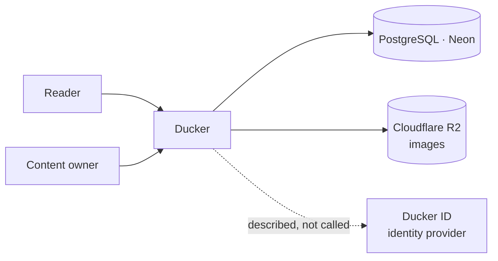
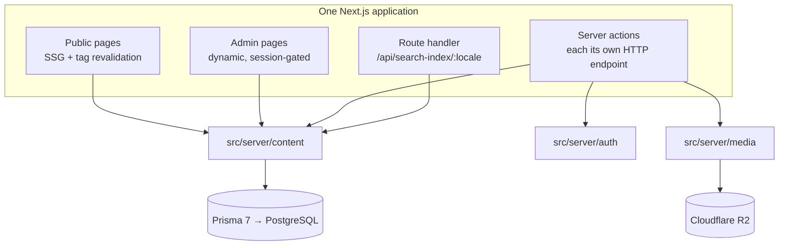

# Architecture

> **Answers:** How does the system fit together, and where are the boundaries between its parts?
> **Status:** 🟢 complete
> **Updated:** 2026-09-13 · commit b2d70a8
> **Update when:** a module or service is added or removed · two modules change how they talk

<!-- HOW TO FILL
Level: C4 level 1 (context) and level 2 (container). Do NOT descend to classes or
functions — that is code, and code describes itself more precisely than prose can.

Section 3 (module boundaries) is the section an AI uses most: it decides where new code
goes. One line per module: name · one-sentence responsibility · who it may call.

Section 5 lists technology NAMES plus an ADR number. The REASON lives in the ADR, not
here — copy it and the two copies drift.

DOES NOT CONTAIN: why a technology was chosen (-> decisions/), invariants
(-> invariants.md), detailed schema (-> prisma/schema.prisma), the function inventory
(-> 02-requirements/scope.md).
-->

## 1. Context — who the system sits between

The dotted edge is the point: Ducker **documents** the identity provider, it does not
call it. No satellite app is wired into it yet — see
[ADR-0009](../decisions/0009-the-page-states-current-reality.md).

## 2. Container — the runnable pieces

One deployable. No separate API service: server actions write straight through the
content layer ([ADR-0001](../decisions/0001-nextjs-fullstack-single-repo.md)).

## 3. Modules and boundaries

The first three rows are the **three doors**, and they are not a convention — there is
a test that scans the source and fails if one is bypassed
(`src/server/auth/boundary.test.ts`).

| Module | One-sentence responsibility | May call | **Must not** call |
| --- | --- | --- | --- |
| `src/server/content/` | The only place that touches Prisma; queries, mutations, cache tags, invariant checks | `src/server/db.ts`, Prisma | Auth.js, the S3 SDK |
| `src/server/auth/` | The only place that knows Auth.js. Exposes exactly `getCurrentUser()`, `requireAdmin()`, `signOut()`, plus `login-path.ts` | Auth.js, `rate-limit.ts` | Prisma, `next-intl` (guarded by a test — locale awareness is isolated in `login-path.ts`) |
| `src/server/media/` | The only place that knows Cloudflare R2 | the S3 SDK, `image-size` | Prisma, Auth.js |
| `src/app/` | Routing, page composition, server actions | the three modules above | Prisma, Auth.js, the S3 SDK **directly** |
| `src/components/` | Presentation | props, `next-intl` | any of the three modules; any data access |
| `src/lib/` | Pure helpers — markdown rendering, formatting | nothing project-specific | anything with I/O |
| `src/i18n/` | Interface strings and the generated locale list | — | the database |

Because of this, changing the cache, the database, the storage provider or the
authentication mechanism each touches exactly one layer. It is also why swapping to
Ducker ID sign-in is *one new file*, `src/server/auth/providers/idms-oauth.ts`.

## 4. The path everything else follows

**Editing content and seeing it live** — the product's central promise:

1. The owner saves in the CMS → a **server action** fires. Its first line is
   `await requireAdmin()`, because the action is a public HTTP endpoint of its own and
   the `/admin` layout guard does not cover it.
2. The action calls `src/server/content/mutations.ts`, which validates the invariants
   (see [`invariants.md`](invariants.md)) inside one transaction.
3. On success it calls `revalidateTag` for the affected tags.
4. The next request to the public page re-renders it and the CDN copy is replaced.

Two consequences fall out of step 3, and both have cost real debugging time:

- Tag revalidation is **stale-while-revalidate**: the *first* view after a write can
  still be the old copy.
- A write that does **not** pass through the running server (`prisma db seed`, an e2e
  run on another port, hand-typed SQL) never reaches step 3. The cache lives on disk in
  `.next/cache`, so restarting does not help either — `rm -rf .next`. See
  [ADR-0012](../decisions/0012-ssg-cache-is-per-process-and-on-disk.md).

## 5. Tech stack

| Layer | Technology | Justification |
| --- | --- | --- |
| Framework | Next.js 16, App Router, full-stack, one repo | [ADR-0001](../decisions/0001-nextjs-fullstack-single-repo.md) |
| Database | PostgreSQL on Neon, Prisma 7 | [ADR-0002](../decisions/0002-postgres-on-neon-with-prisma.md) |
| Rendering | SSG + on-demand tag revalidation | [ADR-0004](../decisions/0004-ssg-with-tag-revalidation.md) |
| Translation model | locale as a **row** in `*Translation` tables | [ADR-0003](../decisions/0003-locale-as-row-not-column.md) |
| Section body | JSON with a `type` discriminator | [ADR-0005](../decisions/0005-section-body-as-tagged-json.md) |
| Auth | Auth.js Credentials behind a three-function abstraction | [ADR-0006](../decisions/0006-auth-behind-a-three-function-abstraction.md) |
| Images | Cloudflare R2 | [ADR-0013](../decisions/0013-cloudflare-r2-for-images.md) |
| Navigation | one self-referencing `NavNode` tree, three node kinds | [ADR-0014](../decisions/0014-one-nav-tree-three-node-kinds.md) |
| URLs | flat, the tree controls navigation display only | [ADR-0007](../decisions/0007-flat-urls-tree-controls-navigation-only.md) |
| Typography | system fonts only, Georgia banned | [ADR-0008](../decisions/0008-system-fonts-only-georgia-banned.md) |
| i18n routing | `next-intl` middleware at the edge | [ADR-0015](../decisions/0015-generated-locale-list-costs-one-redeploy.md) |
| Hosting | Vercel Hobby | [`overview.md`](../01-product/overview.md) §5 |

## 6. Known architectural limit

**Adding a language needs one redeploy.** Editing *content* does not. The middleware
runs at the edge and cannot reach the database, so the enabled-locale list is generated
at `prebuild` by `scripts/generate-locales.ts` into `src/i18n/locales.generated.ts`.
Reordering languages in the CMS therefore also takes effect only after the next deploy.
Accepted deliberately — [ADR-0015](../decisions/0015-generated-locale-list-costs-one-redeploy.md).
